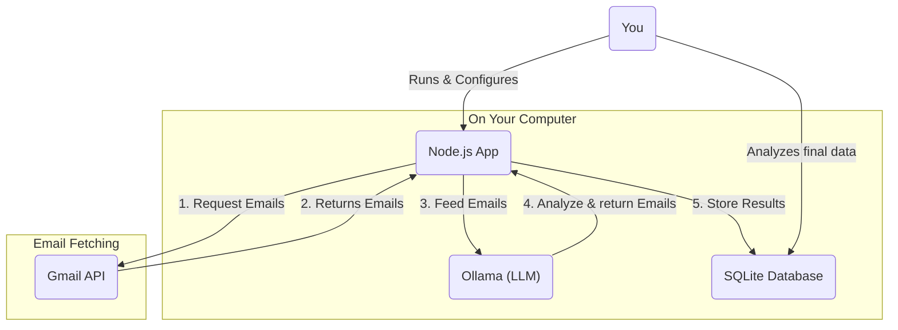

# AI Job Application Analyzer for Gmail

This is a Node.js script I wrote to clean up my messy job application inbox. It scans my Gmail, uses a local AI (Ollama) to figure out what each email is about (rejection, interview, etc.), and saves everything into a clean SQLite database so I can actually analyze my job search.

## Why I Made This

Simple: I was applying to a lot of jobs and my inbox was a complete disaster. I wanted to answer basic questions but couldn't:

*   How many rejections have I gotten? Bruh.
*   Which companies are actually getting back to me for interviews?
*   Am I getting more responses from LinkedIn or Indeed?
*   What's my interview-to-application ratio?

Doing this manually was boring. This script automates it.

## How It Works

It's pretty straightforward:

1.  **Connects to Gmail:** It uses the official (and secure) Google OAuth method, so it only gets read-only access. It never sees your password.
2.  **Finds Emails:** It searches your Gmail for emails matching a query you set in the config (e.g., `(apply OR application OR interview)`). It processes them in batches so it doesn't crash.
3.  **Asks the AI:** It sends the important parts of each email (sender, subject, body) to a local LLM running on your machine (like Ollama). I gave it a detailed prompt to pull out structured info like the category (`rejection`, `interview`), company name, job title, etc., and return it as JSON.
4.  **Saves the Results:** It stores this clean, structured data in a local SQLite database file (`job_emails.db`). It's smart enough not to process the same email twice.




## What You'll Need

*   **Node.js** (v18+)
*   A **Google Account**
*   A local AI server running, like **[Ollama](https://ollama.com/)**. You'll need to have a model pulled (e.g., `ollama pull llama3`).

## How to Use It

### Step 1: Clone and Install

First, get the code and install the dependencies.

```bash
git clone https://github.com/your-username/your-repo-name.git
cd your-repo-name
npm install
```

### Step 2: Set up Google API Access

This part is a bit of a pain, but you only have to do it once.

1.  Go to the [Google Cloud Console](https://console.cloud.google.com/) and create a new project.
2.  Enable the **Gmail API** for that project.
3.  Go to **APIs & Services -> OAuth consent screen**.
    *   Select **External** and create it.
    *   Fill out the app name (e.g., "My Job Search Analyzer") and your email.
    *   In the "Scopes" step, add the `.../auth/gmail.readonly` scope.
    *   In the "Test users" step, add your own Gmail address.
4.  Go to **APIs & Services -> Credentials**.
    *   Click **+ Create Credentials -> OAuth client ID**.
    *   Choose **Desktop app** for the application type.
    *   After you create it, Google will give you a **Client ID** and a **Client Secret**. Copy these.

### Step 3: Configure the Project

Copy the example environment file.

```bash
cp .env.example .env
```

Now open the new `.env` file and fill it out:

```env
# Paste the credentials you got from Google
GOOGLE_CLIENT_ID="YOUR_CLIENT_ID.apps.googleusercontent.com"
GOOGLE_CLIENT_SECRET="YOUR_CLIENT_SECRET"
# Leave this empty for now, the next step will generate it
GOOGLE_TOKENS=''

# The Gmail search query to find job-related emails
GMAIL_SEARCH_QUERY="subject:(application OR apply OR interview OR career)"

# Your local Ollama server settings
LLM_BASE_URL="http://localhost:11434"
LLM_MODEL="llama3" # Or whatever model you downloaded
```

### Step 4: Authorize with Google

Now you need to generate a token so the script can log in on your behalf.

1.  Make sure your local Ollama server is running.
2.  Run the token script:
    ```bash
    node src/get-token.js
    ```
3.  It will print a URL. Copy it and paste it into your browser.
4.  Log in with your Google account and approve the permissions.
5.  It will redirect you to a blank page or an error page (that's normal). Copy the **full URL** from your browser's address bar.
6.  Paste the URL back into your terminal.
7.  The script will print out the `GOOGLE_TOKENS` line. Copy this entire line and **paste it into your `.env` file**, replacing the empty one.

### Step 5: Run the Analyzer

That's it for setup. Now just run the main script.

```bash
npm start
```

It will show you its progress as it goes through the batches of emails.

### Step 6: Check Your Data

After the script finishes, you'll have a `email_analysis.db` file in the project folder. You can open this with a tool like [DB Browser for SQLite](https://sqlitebrowser.org/) to look at the data and run queries.

For example, you can easily find out how many rejections you have from each company:

```sql
SELECT company, COUNT(*) as rejection_count
FROM job_emails
WHERE category = 'rejection' AND company IS NOT NULL
GROUP BY company
ORDER BY rejection_count DESC;
```